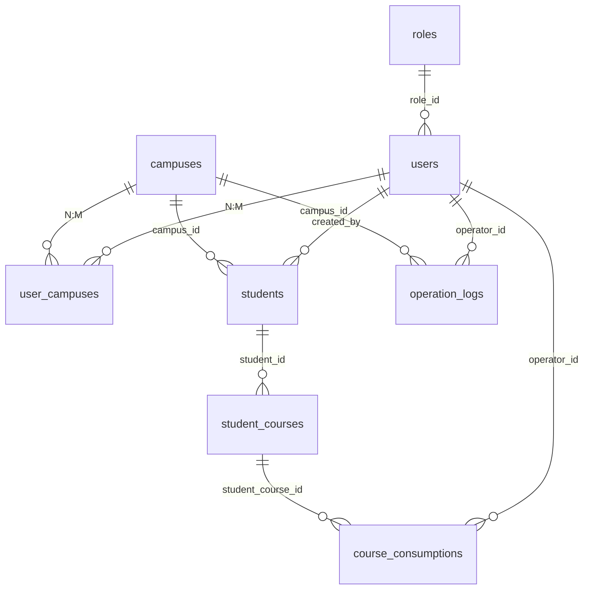

# 第三阶段 ER、约束与软删除说明（3.1–3.8）

本文档覆盖数据模型关系、关键字段、索引与 **3.4 软删除策略**；迁移步骤见 `第三阶段-数据库验证清单.md`。

## 实体关系（Mermaid）



文字版（与上等价）：

```text
roles 1 ──< users
campuses 1 ──< user_campuses >── n users
campuses 1 ──< students
users 1 ──< students (created_by)
students 1 ──< student_courses 1 ──< course_consumptions
users 1 ──< course_consumptions (operator_id)
campuses 1 ──< operation_logs (campus_id 可空)
users 1 ──< operation_logs (operator_id)
```

## 关键字段语义（与产品设计对齐）

| 字段 | 说明 |
| --- | --- |
| `students.paid_status` | 是否交费（布尔），用于欠费展示与报表 |
| `students.total_amount` | 学生总金额（Decimal） |
| `student_courses.course_price` | 单课程价格 |
| `student_courses.total_hours` / `remaining_hours` | 总课时 / 剩余课时（允许负数表示超额消课） |
| `course_consumptions.consumption_time` | 消课业务时间 |
| `students.created_by` | 创建该学生记录的销售（`users.id`） |
| `students.campus_id` | 校区隔离主维度 |
| `*.deleted_at` | 见下节「软删除策略」 |

## 3.4 软删除策略（定稿）

| 表 | 策略 | 原因 |
| --- | --- | --- |
| `students` | 增加 `deleted_at`，业务查询默认 `deleted_at IS NULL` | 支持「删除学生」后仍保留审计与统计可能；软删后可在同校区**重新录入同名**（见部分唯一索引） |
| `student_courses` | 增加 `deleted_at` | 课程行删除与列表默认过滤一致；物理删除仍可通过 `student` 级联在**硬删学生**时清理（见下） |
| `course_consumptions` | **不**设 `deleted_at` | 消课为历史事实记录，纠错走业务冲正/备注，不在本阶段做行级软删 |
| `operation_logs` | 增加 `deleted_at` | 对应后台「删除日志」：列表默认隐藏已删行，库内可保留备查（若产品要求物理删，可改为硬删 + 在应用层实现） |

### 同校区姓名唯一（与软删兼容）

- Prisma 层已去掉「全表」`@@unique([campus_id, name])`。  
- 数据库层使用 **部分唯一索引**：`UNIQUE (campus_id, name) WHERE deleted_at IS NULL`（迁移 `20260402120000_soft_delete_and_partial_unique`）。  
- 业务层：新建/编辑学生前仍应查**未删除**重名。

## 唯一约束与普通索引（3.3 + 3.4 补充）

| 类型 | 说明 |
| --- | --- |
| 唯一 | `roles.code`、`users.username`、`user_campuses(user_id, campus_id)` |
| 部分唯一 | `students(campus_id, name)` 当且仅当 `deleted_at IS NULL` |
| 复合索引 | `students(campus_id, created_by)` 等 |
| 软删筛选 | `students`、`student_courses`、`operation_logs` 上 `deleted_at` 索引 |

## 外键与级联（物理删除路径）

- **硬删** `students` 时：`student_courses`、`course_consumptions` 仍按库上 **ON DELETE CASCADE** 级联清理（开发/运维慎用）。  
- **软删** `students` 时：不触发 FK 级联；应在后续业务层同步软删其课程行，或保留子行仅用于历史（由产品决定，建议列表统一按 `deleted_at` 过滤）。

## 迁移文件

1. `prisma/migrations/20260401120000_phase3_business_tables/migration.sql` — 初版业务表  
2. `prisma/migrations/20260402120000_soft_delete_and_partial_unique/migration.sql` — 软删除 + 部分唯一索引  

应用与种子：

```bash
cd backend
npx prisma migrate deploy
npx prisma generate
npm run prisma:seed
```

## 3.8 自检（阶段完成参考）

- [x] `schema.prisma` 覆盖流程文档表，同校区姓名唯一（未删除行）已体现  
- [ ] `migrate` 在**你的** PostgreSQL 上成功执行（需本地/服务器环境）  
- [ ] `prisma db seed` 成功，含演示学生/课程/消课（可选演示块）  
- [x] ER 与软删除、级联说明已写入本文档  
- [x] 校区维度、创建人维度可查询（字段 + 索引）  
